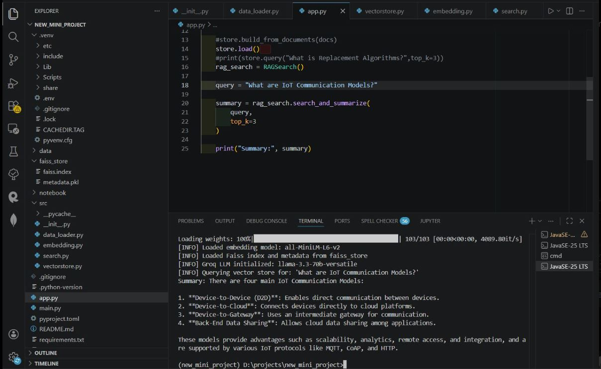
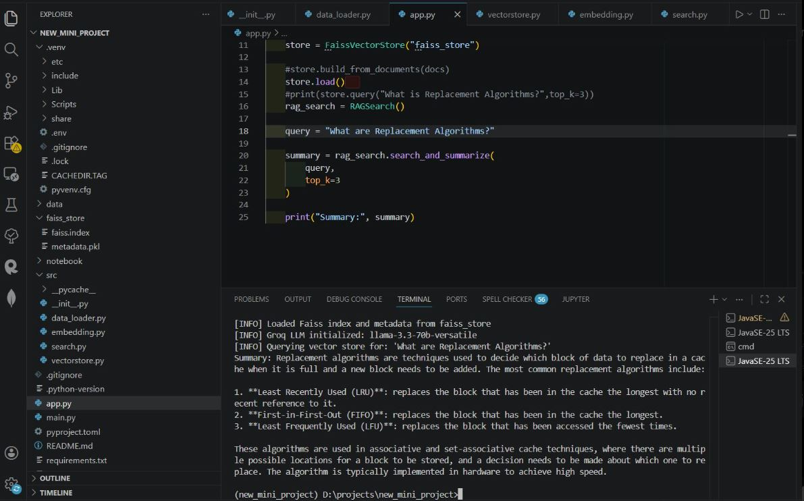

# 📚 RAG PDF Question Answering System

## Overview

This project is a Retrieval-Augmented Generation (RAG) application that answers user questions based on information retrieved from PDF and text documents.

The system loads documents, splits them into chunks, generates embeddings using Sentence Transformers, stores them in a FAISS vector database, retrieves the most relevant context for a query, and uses a Groq-powered LLM to generate accurate answers.

---

## 🚀 Features

* PDF document loading
* Text file loading
* Document chunking
* Embedding generation using Sentence Transformers
* FAISS vector database
* Semantic search and retrieval
* Groq LLM integration
* Context-aware question answering
* Modular project structure

---

## 🛠️ Tech Stack

* Python
* LangChain
* FAISS
* Sentence Transformers
* Groq API
* NumPy
* PyPDF
* Git & GitHub

---

## 📂 Project Structure

```text
rag-pdf-question-answering/
│
├── data/
│   ├── pdf/
│   └── text_files/
│
├── notebook/
│   ├── document.ipynb
│   └── pdf_loader.ipynb
│
├── src/
│   ├── __init__.py
│   ├── data_loader.py
│   ├── embedding.py
│   ├── vectorstore.py
│   └── search.py
│
├── app.py
├── main.py
├── requirements.txt
├── pyproject.toml
└── README.md
```

---

## ⚙️ How It Works

```text
Documents (PDF/TXT)
        │
        ▼
Document Loader
        │
        ▼
Text Chunking
        │
        ▼
Sentence Transformer Embeddings
        │
        ▼
FAISS Vector Store
        │
        ▼
Retriever
        │
        ▼
Groq LLM
        │
        ▼
Generated Answer
```

---

## Installation

### 1. Clone Repository

```bash
git clone https://github.com/shravanipatil2303/rag-pdf-question-answering.git

cd rag-pdf-question-answering
```

### 2. Create Virtual Environment

```bash
uv venv

.venv\Scripts\activate
```

### 3. Install Dependencies

```bash
uv sync
```

or

```bash
pip install -r requirements.txt
```

### 4. Create .env File

```env
GROQ_API_KEY=your_groq_api_key
```

### 5. Run Application

```bash
python app.py
```

---

## Example Queries

### Query

```text
What are IoT Communication Models?
```

### Response

```text
1. Device-to-Device (D2D)
2. Device-to-Cloud
3. Device-to-Gateway
4. Back-End Data Sharing
```

---

### Query

```text
What are Replacement Algorithms?
```

### Response

```text
Replacement algorithms determine which page should be replaced
when a page fault occurs in memory management.
Examples include FIFO, LRU, and Optimal Page Replacement.
```

---

## 📸 Project Screenshots

### Query: What are IoT Communication Models?



The system retrieves relevant document chunks from the FAISS vector store and generates a context-aware answer using Groq LLM.

---

### Query: What are Replacement Algorithms?



The RAG pipeline successfully retrieves information related to memory management concepts and generates an accurate summarized response.

---

## Sample Results

| Query | Output |
|---------|---------|
| What are IoT Communication Models? | Device-to-Device, Device-to-Cloud, Device-to-Gateway, Back-End Data Sharing |
| What are Replacement Algorithms? | FIFO, LRU, LFU and other cache/page replacement techniques |

## Author

**Shravani Patil**

GitHub: https://github.com/shravanipatil2303

---

## License

This project is created for educational and learning purposes.

---
